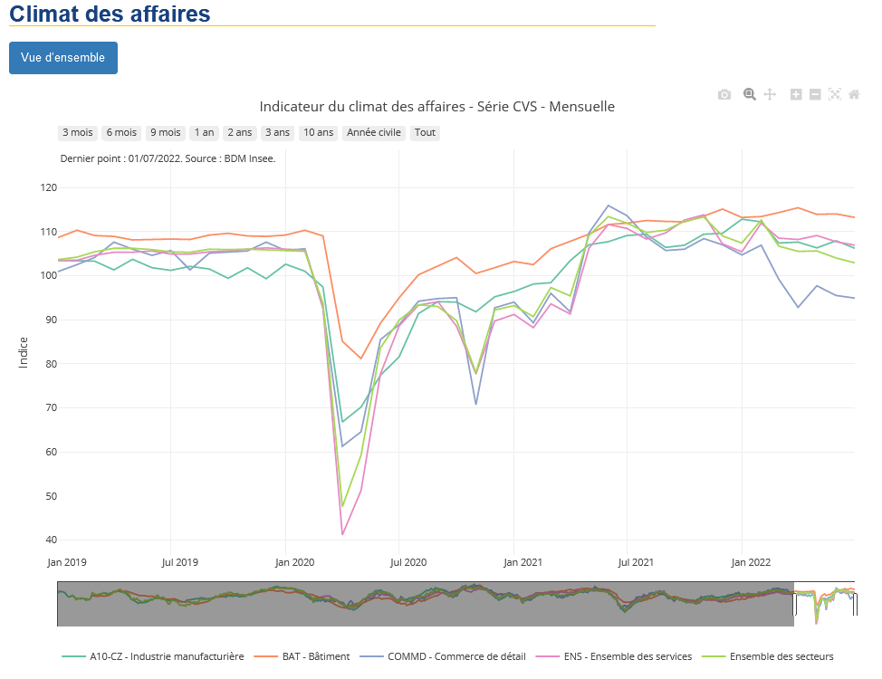

Quick charts
================

## Overview

quickcharts creates an html file of plots from series of the BDM Insee API.

The html file output will be saved in a folder "html" inside the Rstudio working directory.


## Installation, Loading and Use

You can either properly install the application or just download the source code.

### 1st method: Proper installation
``` r
# Install the dependencies
install.packages(c("dplyr", "devtools", "magrittr", "plotly", "rmarkdown", "stringr", "rlang", "tidyr", "insee"))

# Download and extract the zip file of quickcharts
# set the working directory to the folder containing the zip file
# example : setwd("C:\Users\ID\Documents\")

# Install quickcharts package with devtools
devtools::install_local("quickcharts-main.zip")

# Load the app
library(quickcharts)

# Use the app
quickCharts()

```

### 2nd method: No installation

``` r
# Install the dependencies
install.packages(c("dplyr", "devtools", "magrittr", "plotly", "rmarkdown", "stringr", "rlang", "tidyr", "insee"))

# Download and extract the zip file of quickcharts

# Open quickcharts.Rproj with Rstudio

# Load the app
devtools::load_all(".")

# Use the app
quickCharts()

```

The process will take 5-10 minutes and the html file output will be saved in a folder "html" inside the Rstudio working directory.


## HTML output demo



## Automatic updates of the webpage

The webpage [https://jdesclodure.github.io/quickcharts/](https://jdesclodure.github.io/quickcharts/) is automatically updated on the 5th, 15th and 20th of each month.

## Contributing

If you want to test and/or add series then you will have to amend inst/rmd/quickcharts.Rmd file.
Moreover, you could uncomment the ligns 48 to 65 to be able to launch individual chunk code.

## License

GNU GENERAL PUBLIC LICENSE (GPL-3)